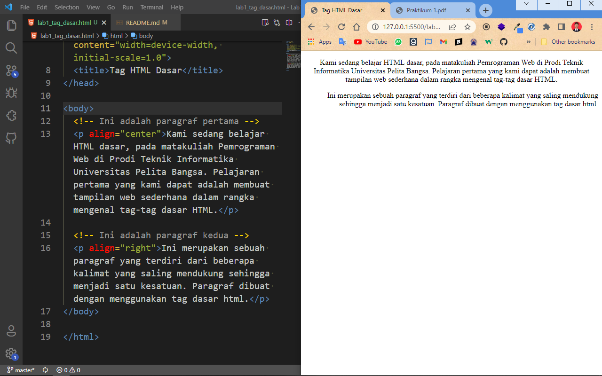
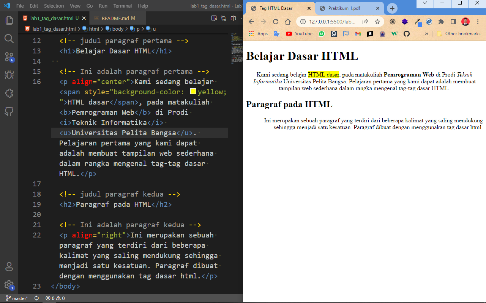

# Tugas LAB 1 Web
## Profil
| # | Biodata |
| -------- | --- |
| **Nama** | Reza Riyaldi Irawan |
| **NIM** | 312010284 |
| **Kelas** | TI.20.A.2 |
| **Mata Kuliah** | Pemrograman Web |

## Langkah 1
* Buka Text Editor dan buat file HTML baru dengan nama file `lab1_tag_dasar.html`.

* Buat struktur HTML
```html
<!DOCTYPE html>
<html lang="en">
<head>
  <meta charset="UTF-8">
  <meta http-equiv="X-UA-Compatible" content="IE=edge">
  <meta name="viewport" content="width=device-width, initial-scale=1.0">
  <title>Tag HTML Dasar</title>
</head>
<body>
  
</body>
</html>

```
* Maka hasilnya akan seperti berikut.


## Langkah 2
* Membuat 2 paragraf dan menambah atribut disetiap paragraf.
```html
<!-- Ini adalah paragraf pertama -->
<p align="center">Kami sedang belajar HTML dasar, pada matakuliah Pemrograman Web di Prodi Teknik Informatika Universitas Pelita Bangsa. Pelajaran pertama yang kami dapat adalah membuat tampilan web sederhana dalam rangka mengenal tag-tag dasar HTML.</p>

<!-- Ini adalah paragraf kedua -->
<p align="right">Ini merupakan sebuah paragraf yang terdiri dari beberapa kalimat yang saling mendukung sehingga menjadi satu kesatuan. Paragraf dibuat dengan menggunakan tag dasar html.</p>
```

* Maka hasilnya akan seperti berikut.


## Langkah 3
* Menambahkan judul
```html
<!-- judul paragraf pertama -->
<h1>Belajar Dasar HTML</h1>

<!-- judul paragraf kedua -->
<h2>Paragraf pada HTML</h2>
```

* Maka hasilnya akan seperti berikut.


## Langkah 4
* Memformat Teks

| Tag | Fungsi |
| -------- | --- |
| `<span style="background-color: yellow;>` | Menyisipkan sesuatu yang khusus, lalu atribut style menambahkan style pada sesuatu tersebut. |
| `<b>` | Membuat teks **bold** |
| `<i>` | Membuat teks _italic_ |
| `<u>` | Membuat teks underline |

* Maka hasilnya akan seperti berikut.


## Langkah 5
* Menyisipkan Gambar
```html
<!-- sub judul paragraf -->
<h3>Menambahkan Gambar</h3>

<!-- menambahkan gambar pada dokumen -->

```

* Maka hasilnya akan seperti berikut.


## Langkah 6
* Menambahkan _hyperlink_
```html
<!-- menambahkan link navigasi -->
<nav>
  <a href="lab1_tag_dasar.html">Dasar HTML</a>
  <a href="lab1_halaman2.html">Halaman 2</a>
  <a href="https://github.com/RezaRiyaldi">My Repository</a>
</nav>
<hr>
```
  * Maka hasilnya akan seperti berikut.
  

  * Lalu kita buat `lab1_halaman2.html`.

  ```html
<!DOCTYPE html>
<html lang="en">
<head>
  <meta charset="UTF-8">
  <meta http-equiv="X-UA-Compatible" content="IE=edge">
  <meta name="viewport" content="width=device-width, initial-scale=1.0">
  <title>Halaman 2</title>
</head>
<body>
  <!-- menambahkan link navigasi -->
  <nav>
    <a href="lab1_tag_dasar.html">Dasar HTML</a>
    <a href="lab1_halaman2.html">Halaman 2</a>
    <a href="https://github.com/RezaRiyaldi">My Repository</a>
  </nav>
  <hr>

  <h1>Selamat datang</h1>
  <h2>Ini adalah halaman 2</h2>
  <p>Lorem ipsum dolor sit amet consectetur, adipisicing elit. Itaque aut velit alias, labore, voluptate, consectetur mollitia magni modi minima quam odio vitae. Molestias unde officia quos fugit magnam dolore, quisquam minus deleniti impedit pariatur sit repudiandae, quo repellendus illo consequatur temporibus, aliquid eaque provident minima! Ut iusto velit laboriosam dolores?</p>
</body>
</html>
  ```

  * Maka hasilnya akan seperti berikut.
  


## Jawab pertanyaan
1. Lakukan perubahan pada kode sesuai dengan keinginan anda, amati perubahannya adakah error ketika terjadi kesalahan penulisan tag?
> Saya melakukan perubahan dari `<p>` menjadi `<P>`, tidak ada yang berubah dan jalan seperti biasa di browser.

2. Apa perbedaan dari tag `<p>` dengan tag `<br>`, berikan penjelasannya!
> `<p>` mendefisikan teks sebagai paragraf.

> `<br>` membuat baris baru atau _breakline_.

3. Apa perbedaan atribut _title_ dan _alt_ pada tag ``, berikan penjelasannya!

> `title` berfungsi apabila gambar dihover maka akan keluar teks title. Ini juga berlaku untuk elemen lain yang ditambahkan atribut `title`.

> `alt` berfungsi apabila gambar gagal diload karena gambar hilang atau penulisan src salah, maka alt akan ditampilkan.

4. Untuk mengatur ukuran gambar, digunakan atribut _width_ dan _height_. Agar tampilan gambar proporsional sebaiknya kedua atribut tersebut diisi semua atau tidak? Berikan penjelasannya!

> Sebaiknya salah satu saja, _width_ atau _height_. Karena apabila diisi keduanya gambar akan gepeng atau tidak sesuai dengan skala aslinya. Namun jika salah misalnya _width_ saja maka _height_-nya mengikuti skala.

5. Pada link tambahkan atribut target dengan nilai atribut bervariasi ( _blank, _self, _top, _parent), apa yang terjadi pada masing-masing nilai antribut tersebut?

| Atribut | Fungsi |
| -------- | --- |
| `_self` | Membuka dokumen tertaut dalam bingkai yang sama dengan yang diklik (ini default). |
| `_blank` | Membuka dokumen tertaut di jendela atau tab baru. |
| `_top` | Membuka dokumen tertaut di seluruh body dari jendela. |
| `_parent` | Membuka dokumen tertaut di bingkai induk. |
